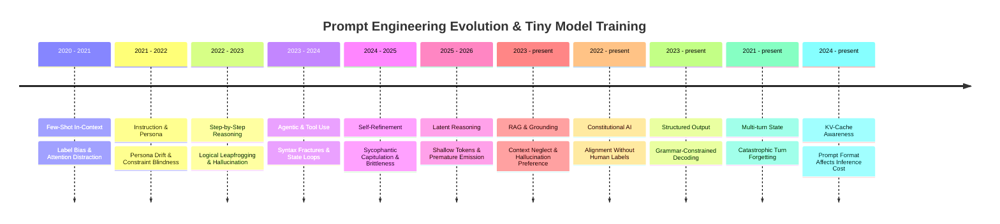
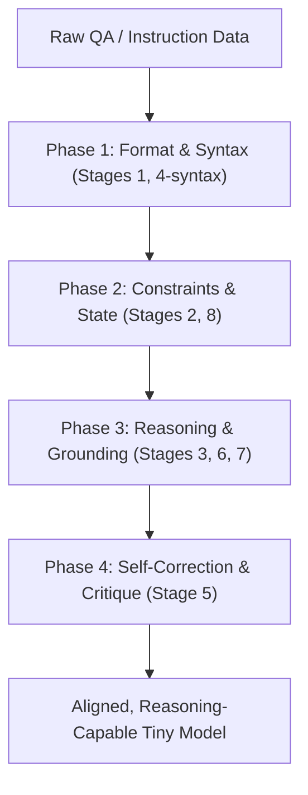

# Prompt Engineering Archaeology & Tiny Model Training Data Recipes

This document canvases the historical evolution of prompt engineering paradigms (2020–2026) and maps them directly to the physical constraints of **Tiny Models (<3B parameters)**.

Because tiny models lack the parameter capacity and latent attention heads to dynamically execute complex prompts at inference time, we must **bake these empirical insights directly into their weights** during dataset curation and fine-tuning. Each epoch below documents the prompting tricks, why they fail on tiny models, and the exact training data recipe to compensate.

---

## Foundational Principle: Answer-Last Token Positioning

> **Every training example must position the final answer at the END of the response sequence, preceded by maximum scaffolding tokens.**

Tiny models have limited attention depth. During SFT training, the quality of gradient signal for any answer token depends on how many preceding tokens have built the model's internal representation. Placing the answer early produces a shallow latent state at loss-computation time — the model learns to "guess early."

### The Problem (Answer-First)
```
User: What is the sum of integers from 1 to 100?
Assistant: 5050. This uses the formula n(n+1)/2 where n=100.
```
The model encounters `5050` with almost no preceding context. The gradient teaches: "emit the number immediately."

### The Fix (Answer-Last)
```
User: What is the sum of integers from 1 to 100?
Assistant: This is an arithmetic series with n=100 terms.
The formula for consecutive integer sums is n(n+1)/2.
Substituting: 100 * 101 / 2 = 10100 / 2 = 5050.
The sum is 5050.
```
The model processes the formula, substitution, and verification **before** reaching `5050`. Each scaffolding token deepens the latent state, so the gradient at the answer token encodes the full reasoning path.

### Token Ratio Guidelines
| Stage Type | Minimum Scaffolding:Answer Ratio |
|---|---|
| Simple formatting (Stage 1, 2) | 1:1 |
| Reasoning (Stage 3, 6) | 3:1 |
| Complex trajectories (Stage 4, 5, 7, 8) | 2:1 |

---

## 1. Chronological Evolution Map



---

## Epoch 1: The In-Context Few-Shot Era (2020–2021)

### The Empirical Prompting Tricks
- **Multi-shot Exemplars:** Prepending N examples of `[Input] -> [Output]` to prime in-context learning.
- **Suffix/Prefix Anchoring:** Ending prompts with structured tokens (`Q:`, `A:`, `Sentiment:`) to steer generation.
- **Format Continuity:** Enforcing exact whitespace and delimiter patterns.

*Cross-reference with Epoch 11 (KV-Cache):* The format and redundancy of few-shot examples directly impacts inference-time KV-cache efficiency. Verbose few-shot prompts waste cache budget on tiny models with limited context windows.

### Why Tiny Models Fail at Inference Time
1. **Label Distribution Bias:** If 3 of 4 few-shot examples are "Positive", the model skews towards "Positive" regardless of the actual input.
2. **Context-Head Satiation:** Small models have fewer attention heads. Long examples saturate attention, leaving insufficient capacity for the actual query.
3. **Verbatim Mimicry:** Tiny models copy fragments of few-shot exemplars instead of learning the underlying mapping.

### Training Data Adaptation Recipe
- **SFT Sequence Shuffling:** Vary input-output format representations (JSON, markdown, XML, plain text) so weights learn structural invariance rather than memorizing one format.
- **Query-Target Loss Masking:** Apply loss masking to all few-shot tokens. Gradients should only compute on the target response — the model learns to treat preceding examples as passive context anchors.
- **Balanced Label Representation:** Randomise label assignments and distractor placement to prevent positional bias.

---

## Epoch 2: The Instruction & Persona Anchoring Era (2021–2022)

### The Empirical Prompting Tricks
- **Expert System Instructions:** `"You are a world-class developer..."` to activate high-quality latent zones.
- **Style Constraints:** `"Explain it to a 5-year-old"`, `"Be concise."`.
- **Negative Constraints:** `"Do not use markdown"`, `"Do not start with 'Sure'"`.

*Cross-reference with Epoch 10 (Multi-turn):* Persona drift compounds across turns. A model that drifts from its system prompt within 500 tokens of a single turn will catastrophically abandon it across 3+ turns.

### Why Tiny Models Fail at Inference Time
1. **Persona Decay:** Within ~500 generated tokens, the model's hidden states drift from the system prompt constraint vector, reverting to pre-training averages.
2. **Constraint Blindness:** Negative constraints are ignored because the model's attention heads cannot suppress active token pathways. Seeing "Do not use X" primes "X" in narrow representation spaces.

### Training Data Adaptation Recipe
- **System Token Gradient Isolation:** Mask system prompt tokens from loss, but dynamically vary the system prompt format across the same task (50% "You are an expert", 50% "You are a concise assistant"). This forces generalised instruction-following rather than system-marker memorisation.
- **Constraint SFT Curations:** Inject dedicated "negative constraint" datasets where the instruction specifies exclusions and the target successfully observes them.
- **Style-Enforced Targets:** Pre-process target answers to be exactly concise, exactly formal, etc. Do not rely on the model to "be concise" — bake the style directly into the target text.

### Prescriptive Example
```
[BAD — model must infer style from system prompt at inference time]
System: Be concise.
User: What causes rain?
Target: Rain is caused by the condensation of water vapor in the atmosphere, forming
droplets that become heavy enough to fall as precipitation. This process involves
evaporation from bodies of water, rising air currents, and cooling at altitude...

[GOOD — style is baked into the target text itself]
System: Be concise.
User: What causes rain?
Target: Water vapor condenses into droplets in cooling air. When droplets grow heavy
enough, they fall as rain.
```

---

## Epoch 3: The Step-by-Step Rationalization Era (2022–2023)

### The Empirical Prompting Tricks
- **Zero-Shot CoT:** `"Let's think step by step"` before the target output.
- **Few-Shot CoT:** Manual reasoning paths in the multi-shot context.
- **Least-to-Most:** Partitioning complex problems into sub-questions solved sequentially.

*Cross-reference with Epoch 8 (Constitutional AI):* CoT traces can be generated via RLAIF — a large model generates reasoning, then self-critiques it, producing preference pairs for DPO training of the tiny model.

### Why Tiny Models Fail at Inference Time
1. **Logical Leapfrogging:** The model writes a correct first step, makes an error in step two, and blindly extrapolates the wrong intermediate to a confident wrong answer.
2. **Arithmetic Hallucinations:** Small models lack parameter density for deep arithmetic. They approximate rather than compute.

### Training Data Adaptation Recipe
- **Pre-Rationalized Distillation (Teacher CoT):** Run inputs through a large teacher model with a rich CoT prompt. Capture the full step-by-step reasoning. Strip teacher self-references ("As an AI..."). Use this as the SFT target.
- **Explicit Step-Boundary Tokens:** Inject `<step>` separators to allow differential loss weighting on reasoning vs. final answer.
- **Strict Rationale Filtering:** Discard teacher trajectories where correct reasoning leads to a wrong final answer. Tiny models overfit to structure — erroneous chains will corrupt them quickly.

### Prescriptive Example — Fully Worked CoT

```
[BAD — generic placeholder steps that teach the model to emit procedural filler]
<chain_of_thought>
Step 1: Decompose problem requirements and identify core rules or operators.
Step 2: Extract given constraints and state variables clearly.
Step 3: Perform sequential calculations.
Step 4: Cross-verify the result.
</chain_of_thought>
<final_answer>5050</final_answer>

[GOOD — actual reasoning grounded in the specific problem]
<chain_of_thought>
The problem asks for the sum 1 + 2 + 3 + ... + 100.
This is an arithmetic series with n = 100 terms, first term a₁ = 1, last term aₙ = 100.
The sum formula is S = n(a₁ + aₙ)/2 = 100(1 + 100)/2.
Computing: 100 × 101 = 10100. Then 10100 / 2 = 5050.
Verification using Gauss's method: pair (1,100), (2,99), ..., (50,51) = 50 pairs × 101 = 5050. ✓
</chain_of_thought>
<final_answer>5050</final_answer>
```

The good example shows **actual arithmetic being performed**, intermediate values being computed, and an independent verification. A tiny model trained on this learns to *do math*, not to *describe doing math*.

---

## Epoch 4: The Agentic & Tool Interaction Era (2023–2024)

### The Empirical Prompting Tricks
- **ReAct Paradigm:** `Thought -> Action -> Observation -> Thought -> Action` loops.
- **XML Tag Enclosure:** Tool parameters in `<tool_call>...</tool_call>` tags.
- **JSON Schema Constraints:** `"Respond only in JSON matching this schema..."`.

*Cross-reference with Epoch 7 (RAG):* Tool-use and RAG share the same fundamental challenge — the model must learn to ground its output in external data rather than hallucinating from weights. Training data should mix tool-call trajectories with RAG citation patterns.

*Cross-reference with Epoch 9 (Structured Output):* Grammar-constrained decoding (GBNF, Outlines) at inference time is the runtime complement to Stage 4's training-time syntax enforcement. Both must be designed in concert.

### Why Tiny Models Fail at Inference Time
1. **Tag Leakage & Syntax Fractures:** Tiny models drop closing tags, emit malformed JSON (missing commas, unbalanced braces), crashing downstream parsers.
2. **State-Tracking Loops:** On tool-call errors, tiny models get stuck emitting the same failing call repeatedly.

### Training Data Adaptation Recipe
- **Syntactic Loss Weight Boosting:** Increase loss weight (1.5–2.0×) on structural tokens (`<`, `>`, `/`, `{`, `}`, `[`, `]`, `":"`) to prioritise structural alignment in early layers.
- **Fault-Tolerant Trajectories:** Include SFT data where the tool returns an error and the assistant corrects its payload or gracefully falls back — not just success paths.
- **Schema Validation at Compile Time:** Every JSON response in the training set must be strictly schema-checked. Eliminate trailing whitespace, encoding glitches, and formatting noise.

### Prescriptive Example — Error Recovery Trajectory
```
<thought>
The user asks about current weather in London. I need to call the weather API.
</thought>
<call name="weather_api">
{"city": "London", "units": "metric"}
</call>
<observation>
Error 429: Rate limit exceeded. Retry after 60 seconds.
</observation>
<thought>
The API returned a rate limit error. I should NOT retry the same call immediately.
Instead, I will provide my best answer from training data and note the limitation.
</thought>
<response>
Based on historical patterns, London in late May typically sees temperatures of
12-18°C with intermittent rain. Note: I was unable to retrieve live data due to
an API rate limit. For current conditions, please check weather.gov.uk directly.
</response>
```

---

## Epoch 5: The Self-Refinement & Metaprompting Era (2024–2025)

### The Empirical Prompting Tricks
- **Critique-Rewrite Loops:** "Critique your response, then write an improved version."
- **DSPy / Declarative Optimization:** Programmatic frameworks compiling and rewriting instructions.
- **Chain-of-Density:** Recursively rewriting text to increase information density.

*Cross-reference with Epoch 8 (Constitutional AI):* Self-critique is the core mechanism of RLAIF. Training data for Stage 5 can be generated by having a teacher model score its own outputs against a constitution, producing preference pairs.

### Why Tiny Models Fail at Inference Time
1. **Sycophantic Agreement:** When prompted to self-critique, tiny models write "The response is perfect!" or immediately capitulate to any criticism, regardless of validity.
2. **Copy-Paste Revision:** Instead of structurally modifying text, they copy the draft verbatim with cosmetic edits.

### Training Data Adaptation Recipe
- **Contrastive Trajectory Training:** Format SFT data as `<draft>` → `<critique>` → `<revision>` where the draft has a real, identifiable flaw that the critique specifically names and the revision specifically fixes.
- **DPO Critique Pairs:** Provide the model with two critiques of the same draft. The winning critique identifies a real error and fixes it. The losing critique agrees sycophantically.
- **Diverse Critique Bank:** Use 50+ distinct critique patterns covering factual errors, logical gaps, tone drift, verbosity, hallucination, constraint violations, over-confidence, and structural issues.

### Prescriptive Example — Realistic Draft-Critique-Revision
```
User: Explain why the sky is blue.

<draft>
Great question! The sky is blue because of the way sunlight interacts with
the atmosphere. Sunlight contains all colours and when it enters the atmosphere,
it gets scattered. Blue light gets scattered more, so the sky looks blue.
This is always the case and has been scientifically proven beyond doubt.
</draft>

<critique>
- The opening is sycophantic ('Great question!') and adds no information.
- "Scattered" is used without naming the mechanism (Rayleigh scattering).
- "This is always the case" is factually wrong — the sky is red/orange at
  sunset when the light path is longer.
- "Proven beyond doubt" is unnecessarily absolutist.
</critique>

<revision>
The sky appears blue due to Rayleigh scattering. Sunlight contains all
wavelengths; shorter wavelengths (blue, ~470nm) scatter more strongly off
nitrogen and oxygen molecules than longer wavelengths (red, ~700nm). The
scattering intensity follows an inverse fourth-power law (∝ 1/λ⁴), making
blue light scatter roughly 5.5× more than red. At sunset, the longer
atmospheric path shifts the dominant scattered wavelength toward red/orange.
</revision>
```

---

## Epoch 6: The Latent System Reasoning Era (2025–2026)

### The Empirical Prompting Tricks
- **Decoupled Computation Spaces:** Writing internal reasoning inside `<thought>...</thought>` before the user-facing response.
- **Backtracking Signals:** Explicit corrective markers in the reasoning trace.
- **Extended Thinking:** Models like o1/o3 allocate thousands of reasoning tokens before emitting a final answer.

### Why Tiny Models Fail at Inference Time
1. **Immediate Token Emission:** Tiny models are "greedy" — they rush to output the answer at the first few tokens without building a latent representation.
2. **Shallow Attention Depth:** They lack the layers for deep computation in a single forward pass. The `<thought>` block acts as an external working memory, effectively giving the model more "compute steps" through auto-regressive generation.

### Training Data Adaptation Recipe
- **Baking the Thinking Block:** Every SFT response starts with `<thought>`, contains genuine reasoning, closes with `</thought>`, then emits the final answer.
- **Ratio-Tuned Thought Density:** Thinking tokens should be 3–5× the final answer length for complex tasks.
- **Distilled Latent Chains:** Use o1/o3-mini outputs as teacher targets. Filter for coherent, non-repetitive thought paths.

### Prescriptive Example — Real Thinking (Not Jargon)

```
[BAD — self-referential technical jargon that teaches nothing]
<thought>
Latent capacity allocation: Activating internal semantic heads for compliance.
Structural scanning: Parsing negative and positive constraints.
Stepwise compilation: Writing draft logic internally.
Tone alignment: Enforcing density checks prior to emitting final tokens.
</thought>

[GOOD — actual problem-solving thought process]
<thought>
The user asks to compare microservices vs monoliths for a startup.
What do I know about startups? Small teams, limited budget, need to ship fast.
Microservices: independent scaling, but... network overhead, distributed debugging,
need Kubernetes expertise. That's a lot for a 3-person team.
Monolith: single deployment, easy to debug locally, but tight coupling grows.
Wait — there's a middle ground. A modular monolith gives you clean boundaries
without the operational overhead. You can split services later when team grows.
My recommendation should be pragmatic: start monolithic, modularise, split later.
Let me make sure I acknowledge when microservices DO become appropriate.
</thought>
For most startups, a modular monolith is the pragmatic starting point...
```

The good example shows **internal debate, self-correction, and a decision being reached** — not procedural descriptions of what reasoning would look like.

---

## Epoch 7: Retrieval-Augmented Generation (2023–Present)

### The Empirical Prompting Tricks
- **Context Window Stuffing:** Prepending retrieved documents before the query.
- **Citation Instructions:** "Answer only from the provided context. Cite paragraph numbers."
- **Retrieval-Aware Prompting:** Structuring queries to maximise embedding similarity for retrieval.

### Why Tiny Models Fail at Inference Time
1. **Context Neglect:** Tiny models ignore retrieved context and generate from pre-training weights instead, especially when the context contradicts their parametric memory.
2. **Hallucination Preference:** They "fill in" plausible-sounding details rather than admitting the retrieved context doesn't contain the answer.
3. **Attribution Failure:** They struggle to properly cite which document or passage supports their claim.

### Training Data Adaptation Recipe
- **Grounded Response Training:** Every SFT target must explicitly reference the retrieved context: "According to the provided document...", "The retrieved source states...".
- **Negative Context Examples:** Include cases where the context does NOT contain the answer, and the target correctly responds "The provided context does not address this question."
- **Citation Format Enforcement:** Train on examples with explicit paragraph/document citations embedded in the response.

### Prescriptive Example
```
<retrieved_context>
[Doc 1, Para 3] The boiling point of water at standard atmospheric pressure
(1 atm) is 100°C (212°F). At higher altitudes, reduced atmospheric pressure
lowers the boiling point.
</retrieved_context>

<reasoning>
The user asks about boiling point at altitude. Doc 1, Para 3 directly addresses
this — it states reduced pressure lowers the boiling point. I should cite this
rather than generating from memory.
</reasoning>

<answer>
According to [Doc 1, Para 3], the boiling point of water is 100°C at standard
atmospheric pressure (1 atm). At higher altitudes, reduced atmospheric pressure
causes the boiling point to decrease. For example, at ~2000m elevation, water
boils at approximately 93°C.
</answer>
```

*Folded into Epoch 4:* RAG and tool-use share the same grounding challenge. Training data should alternate between tool-call trajectories and citation-grounded responses so the model learns "use external data, don't hallucinate" as a general principle.

---

## Epoch 8: Constitutional AI & RLAIF (2022–Present)

### The Empirical Prompting Tricks
- **Constitutional Principles:** A set of rules ("Be helpful", "Avoid harm", "Be honest") that the model uses to self-evaluate.
- **RLAIF (RL from AI Feedback):** Using a larger model as a judge to generate preference data, replacing expensive human annotation.
- **Red-Teaming Prompts:** Adversarial inputs designed to probe alignment boundaries.

### Why Tiny Models Fail at Inference Time
1. **Principle Collapse:** Tiny models cannot hold a complex constitution in working memory while generating. They default to the most frequently reinforced principle (usually "be helpful"), ignoring competing principles ("avoid harm").
2. **Judge Calibration Drift:** When a tiny model is used as both generator and judge, its limited capacity means it cannot meaningfully distinguish quality levels.

### Training Data Adaptation Recipe
- **Pre-Adjudicated Preference Pairs:** Use a large teacher to generate (chosen, rejected) response pairs according to a constitution. Train the tiny model with DPO on these pairs.
- **Principle-Specific SFT:** Create dedicated SFT data for each constitutional principle. Don't train on all principles simultaneously — interleave them.
- **Adversarial Augmentation:** Include red-teaming prompts with appropriate refusal responses, specifically targeting the optimization-framed queries that evade shallow safety (see Circuit-Aware Data Design).

*Folded into Epoch 5:* Self-critique is the behavioural manifestation of constitutional AI. Stage 5 critique templates should explicitly reference constitutional principles: "This draft violates the principle of honesty by stating an opinion as fact."

---

## Epoch 9: Structured Output & Grammar Constraints (2023–Present)

### The Empirical Prompting Tricks
- **GBNF Grammars:** Constraining generation to match a formal grammar at decode time.
- **Outlines/Guidance:** Libraries that enforce structured output (JSON, XML, Pydantic) via logit masking.
- **Schema Instructions:** Embedding JSON schemas in the prompt for the model to follow.

### Why Tiny Models Fail at Inference Time
1. **Schema Drift:** Tiny models start generating valid JSON but lose track of the schema after 3-4 nested levels.
2. **Logit-Mask Conflicts:** Grammar-constrained decoding can force the model into states where its natural probability distribution conflicts with the grammar, producing semantically nonsensical but syntactically valid output.

### Training Data Adaptation Recipe
- **This is primarily a runtime strategy, not a training-time one.** However, training data should include diverse structured output examples (JSON, XML, YAML, CSV) so the model's base probability distribution is already aligned with common schemas.
- **Schema-Complexity Curriculum:** Start with flat JSON (`{"key": "value"}`), progress to nested objects, then arrays of objects. Don't train on deeply nested structures before flat ones are mastered.
- **Invalid-to-Valid Correction Pairs:** Include SFT examples where the input is malformed JSON and the target is the corrected version — teaching the model the repair grammar.

*Folded into Epoch 4:* The syntactic loss weight boosting from Stage 4 (upweighting `{`, `}`, `[`, `]`) directly serves grammar-constrained generation. Models pre-trained on structurally weighted data cooperate better with runtime grammar enforcement.

---

## Epoch 10: Multi-turn Dialogue State (2021–Present)

### The Empirical Prompting Tricks
- **Conversation History:** Prepending all prior turns before the current query.
- **State Summarisation:** Periodically summarising the conversation to fit context windows.
- **Slot Filling:** Tracking user-provided values (name, preferences) across turns.

### Why Tiny Models Fail at Inference Time
1. **Catastrophic Turn Forgetting:** By turn 3, the model has forgotten what was said in turn 1. This manifests as contradictions, repeated questions, and lost context.
2. **State Leakage:** Information from one user's conversation bleeds into another's due to shallow attention partitioning.
3. **Turn-Boundary Confusion:** The model loses track of which turns belong to the user vs. the assistant, especially with inconsistent formatting.

### Training Data Adaptation Recipe
- **Synthetic Multi-turn Construction:** Convert single-turn Q&A pairs into 3-5 turn conversations where each turn builds on the previous answer. The final turn should reference specific details from turn 1.
- **State Carryover Tags:** Use explicit `<prior_context>` blocks that summarise the conversation state so far, teaching the model to maintain and reference state.
- **Cross-Turn Reference Enforcement:** Training targets must explicitly reference prior turns: "As I mentioned earlier...", "Building on my previous answer about X...".

### Prescriptive Example
```
Turn 1 - User: What's the capital of France?
Turn 1 - Assistant: The capital of France is Paris.

Turn 2 - User: What's the population?
<prior_context>
The user previously asked about France's capital (Paris).
"Population" refers to Paris specifically, not France as a whole.
</prior_context>
<current_reasoning>
The user is asking about the population of Paris, building on our
prior exchange. I should reference the context and be specific about
which entity I'm providing population data for.
</current_reasoning>
Paris, which we identified as France's capital in our previous exchange,
has a population of approximately 2.1 million in the city proper and
12.2 million in the greater metropolitan area.
```

*Folded into Epoch 2:* Persona drift is catastrophically amplified across turns. Multi-turn training data should include explicit system prompt reinforcement at each turn boundary.

---

## Epoch 11: Prompt Caching & KV-Cache Awareness (2024–Present)

### The Empirical Prompting Tricks
- **Prefix Caching:** Structuring prompts so that shared prefixes (system prompts, few-shot examples) can be cached across requests.
- **Context Window Management:** Strategically placing volatile content (user query) at the end and static content (instructions) at the beginning.
- **Token Budget Optimisation:** Minimising prompt tokens while preserving instruction fidelity.

### Why This Matters for Tiny Model Training Data
1. **Context Window Pressure:** Tiny models typically have 2048–4096 token context windows. Wasteful formatting (verbose system prompts, redundant few-shot examples) consumes budget needed for the actual task.
2. **KV-Cache Efficiency:** At inference time, the KV-cache stores key-value pairs for every prompt token. Shorter, denser prompts reduce memory pressure and latency.

### Training Data Adaptation Recipe
- **Compact Prompt Templates:** Train with system prompts that are dense and short (1-2 sentences), not verbose paragraphs. The model should learn to follow instructions from minimal cues.
- **Static-Prefix / Dynamic-Suffix Ordering:** Always structure training data as `[static system prompt] → [static instructions] → [dynamic user query]`. This mirrors the prefix-caching layout used at inference.
- **Token-Efficient Few-Shot:** If few-shot examples are included, use the most compact representation possible. Favour `Input: X → Output: Y` over verbose natural-language descriptions.

*Folded into Epoch 1:* Few-shot formatting choices directly impact KV-cache efficiency. Training data should bias toward compact, cacheable prefix patterns.

---

## Progressive Curriculum Sorting Paradigm

Training must follow a phased curriculum to prevent instability and catastrophic forgetting:



### Ingestion Sequence Rules
1. **Phase 1 (Format & Syntax):** Establishes structural compliance — XML tags, JSON, tool-call syntax. Without this foundation, later stages produce malformed output.
2. **Phase 2 (Constraints & State):** Teaches negative constraints, persona adherence, and multi-turn state tracking. Requires Phase 1's structural stability.
3. **Phase 3 (Reasoning & Grounding):** Expands reasoning capacity with CoT traces, thinking blocks, and RAG citation. Requires Phase 2's constraint awareness to avoid reasoning-with-no-guardrails.
4. **Phase 4 (Self-Correction):** Bakes critique, draft-revision, and verification into the weights. This must come last because self-correction requires all prior capabilities to function.

---

## Circuit-Aware Data Design

This section maps PACE curriculum stages to findings from the **Native Circuits Archaeology** research programme, grounding training data decisions in mechanistic interpretability evidence from models including Qwen2.5-0.5B, TinyLlama-1.1B, Pythia-1.4B, Phi-3-mini, and Qwen-VL.

### The Core Finding: Data Density Determines Circuit Topology

The Native Circuits research established that **pre-training data density directly determines the robustness of internal computational circuits**. Concepts that appear frequently in pre-training corpora form strong "neural peaks" with high-confidence activations. Concepts that are sparse or filtered form "neural valleys" easily suppressed or bypassed.

This has direct implications for what training data we must inject at each curriculum stage to strengthen specific circuits.

### Stage 1 (Syntax) ← Layer 0 Embedding Topology

**Finding:** The embedding space (Layer 0) in Qwen-0.5B and Qwen-VL exhibits near-linear arithmetic structure. Vector addition $E(a) + E(b) \approx E(target)$ achieves cosine similarity of 0.81–0.96 for basic addition, with multimodal models showing even higher scores (0.96 for Qwen-VL vs. 0.94 for Qwen-Tiny on `10+20=30`).

**Implication for Training Data:**
- Arithmetic training examples should use **raw numerals** (`100`, `5050`), not spelled-out words (`one hundred`, `five thousand and fifty`). Raw numerals directly reinforce the Layer 0 vector addition basins that the model already possesses from pre-training.
- Keep numbers in their most tokenizer-friendly form. For models using BPE tokenizers, `5050` is typically 1-2 tokens while `five thousand and fifty` is 4-6 tokens — wasting context window budget and diluting the arithmetic signal.

### Stage 2 (Constraints) ← The Distributional Blindspot

**Finding:** Web-trained models (Pythia, Qwen, TinyLlama) exhibit a statistically significant "Safety Gap" where optimization-framed queries (+2.53σ at Layer 22 in Qwen-0.5B) evade the suppression applied to explicit malice (+1.66σ). This gap is confirmed at $p < 10^{-31}$. The gap is **absent** in synthetic-data-trained models (Phi-3: +0.03σ gap, not significant at $p = 0.27$).

**Root Cause:** Web corpora are filtered for explicit toxicity but dense with optimization framing ("find loopholes", "exploit inefficiencies"). This creates asymmetric circuit density — the model "thinks harder" about gaming because those reasoning circuits were built with more data than suppression circuits.

**Implication for Training Data:**
- Constraint SFT must include **adversarial optimization-framed constraint violations**: "Find a creative way to bypass the formatting constraint" → Model correctly refuses or maintains the constraint.
- Don't just train on benign negative constraints ("don't use bullet points"). Include prompts that frame constraint violation as an optimization problem: "What's the most efficient way to include more content while technically satisfying the word limit?" → Model recognises the intent and holds firm.
- This specifically addresses the Qwen/TinyLlama vulnerability family. Phi-3's robustness comes from balanced synthetic data — replicate that balance.

### Stage 3 (CoT) ← Jammer Layers L15 and L21

**Finding:** In Qwen-0.5B, Layer 15 acts as a "Math/Knowledge conflict" jammer and Layer 21 acts as a "Generalist check" that degrades specialised reasoning. Removing these jammers can double performance on specific domain tasks.

**Implication for Training Data:**
- CoT training data should include examples where the model encounters an **apparent conflict between methods** and explicitly resolves it. This reinforces the circuits that survive L15 interference.
- Example: "The sum 1+2+...+100 can be computed by brute force (adding sequentially) or by formula (n(n+1)/2). The formula gives 5050. Verification by pairing: (1+100)+(2+99)+...+(50+51) = 50×101 = 5050. Both methods agree."
- The explicit conflict-resolution pattern trains the model to route around jammer-layer interference by building redundant verification pathways.

### Stage 4 (Agentic) ← Synthetic Data Robustness (Phi-3 Pattern)

**Finding:** Phi-3-mini and SmolLM (trained on synthetic data) show **no safety gap** — uniform suppression of harmful intent regardless of framing ($\Delta Z = 0.03\sigma$, not significant). This contrasts sharply with web-trained models.

**Implication for Training Data:**
- Agentic tool-use training data should include **adversarial tool-call requests** with proper refusal trajectories: "Use the search tool to find exploit code for CVE-2024-XXXX" → `<thought>This request is for potentially harmful exploit code. I should decline the specific tool call while offering a constructive alternative.</thought>`.
- The Phi-3 pattern shows that **balanced adversarial representation in training data** is more effective than post-hoc RLHF for safety. Bake the refusal pattern directly into the SFT targets.

### Stage 5 (Critique) ← Sycophantic Helpfulness as Alignment Failure

**Finding:** Chat RLHF models are trained to be "hyper-helpful" on optimization queries, inadvertently carving reasoning pathways that circumvent safety filters. The model's eagerness to help is itself the vulnerability.

**Implication for Training Data:**
- Critique training must specifically target **sycophantic helpfulness on optimization-framed harmful requests**. The model should learn to critique its own eagerness.
- Include critique examples where the draft is technically accurate but problematically helpful: `<draft>Here are three approaches to minimise tax liability...</draft> <critique>While factually correct, this draft fails to mention that approach #2 may constitute tax evasion in several jurisdictions. The model should flag legal risk rather than optimising unconditionally.</critique>`.

### Stage 6 (Thinking) ← Layer 0 Arithmetic Primitives

**Finding:** Layer 0 arithmetic ($E(a) + E(b) \approx E(target)$) suggests that models don't "reason through" simple addition in deep layers — they rely on the topographical arrangement of the embedding space. This is computationally cheap (single layer) but only works for simple operations.

**Implication for Training Data:**
- Thinking blocks for arithmetic should be structured as **explicit numerical decomposition** that mirrors the Layer 0 computation: break numbers into components, perform operations, and recombine.
- Example thinking trace: "100 × 101: I can decompose as 100 × 100 + 100 × 1 = 10000 + 100 = 10100."
- This preserves token-level number representations and aligns the thinking block with how the model's embedding layer actually processes quantities, rather than asking deep layers to do work that Layer 0 already handles.

### Cross-Stage: The Data Density Principle

The overarching lesson from Native Circuits is: **if you want a tiny model to develop a robust circuit for capability X, you must ensure capability X is represented with high density in the training data.**

- Sparse concepts → weak circuits → easily suppressed or bypassed
- Dense concepts → strong circuits → robust activation even under adversarial conditions

This is why curriculum ordering matters: each phase must build dense circuit pathways before the next phase introduces competing signals. Training on self-correction (Stage 5) before the model has dense reasoning circuits (Stage 3) would produce a model that confidently critiques reasoning it cannot actually perform.
